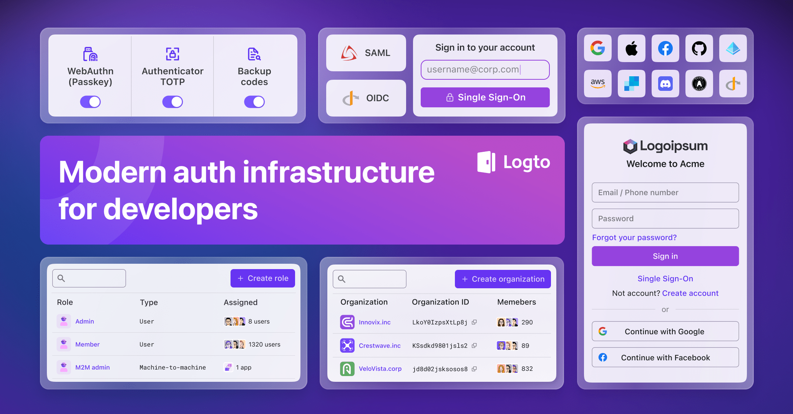

<p align="center">
  <a href="https://github.com/demondayza/myeyesid" target="_blank" align="center" alt="Go to MyEyesID website">
    <picture>
      <source width="200" media="(prefers-color-scheme: dark)" srcset="./logo.png">
      <source width="200" media="(prefers-color-scheme: light)" srcset="./logo.png">
      
    </picture>
  </a>
</p>

[](https://discord.gg/vRvwuwgpVX)
[](https://github.com/demondayza/myeyesid/actions?query=branch%3Amaster)
[](https://github.com/demondayza/myeyesid/releases)
[](https://app.codecov.io/gh/demondayza/myeyesid)
[](https://github.com/demondayza/myeyesid)
[](https://gitpod.io/#https://github.com/demondayza/myeyesid)
[](https://render.com/deploy?repo=https://github.com/demondayza/myeyesid)

# MyEyesID

**MyEyesID is the modern, open-source auth infrastructure for SaaS and AI apps.**

It takes the pain out of OIDC and OAuth 2.1 and makes it easy to build secure, production-ready auth with multi-tenancy, enterprise SSO, and RBAC.

<p align="center">
  <a href="https://github.com/demondayza/myeyesid">website</a> •
  <a href="https://github.com/demondayza/myeyesid">cloud</a> •
  <a href="https://docs.myeyesid.io">docs</a> •
  <a href="https://openapi.myeyesid.io/">api</a> •
  <a href="https://blog.myeyesid.io/">blog</a> •
  <a href="https://auth-wiki.myeyesid.io/">auth wiki</a> •
  <a href="https://github.com/demondayza/myeyesid/stargazers">newsletter</a>
</p>



## Why MyEyesID?

Built for teams scaling SaaS, AI, and agent-based platforms without the usual auth headaches.

With MyEyesID, you get:

- **Multi-tenancy, enterprise SSO, and RBAC**: ready to use, no workarounds.
- **Pre-built sign-in flows**, customizable UIs, and SDKs for 30+ frameworks.
- **Full support for OIDC, OAuth 2.1, and SAML** without the protocol pain.
- **Works out-of-the-box for Model Context Protocol and agent-based AI architectures**.

[🗺️ See all features →](https://docs.myeyesid.io/?ref=readme)

## Get started

Pick your path:

- [**MyEyesID Cloud**](https://github.com/demondayza/myeyesid): The fastest way to try MyEyesID. Fully managed, zero setup.
- [**Launch MyEyesID in GitPod**](https://gitpod.io/#https://github.com/demondayza/myeyesid): Start MyEyesID OSS in seconds.

  Wait for the message `App is running at https://3002-...gitpod.io`, then click the URL starting with `https://3002-` to continue.

- **Local development:**  

  ```bash
  # Using Docker Compose(requires Docker Desktop)
  curl -fsSL https://raw.githubusercontent.com/demondayza/myeyesid/HEAD/docker-compose.yml | \
  docker compose -p myeyesid -f - up

  # Using local sources with a cache-safe rebuild
  ./.scripts/docker-compose-up-fresh.sh
  
  # Using Node.js (requires PostgreSQL)
  npm init @myeyesid
  ```

[📚 Full OSS installation guide →](https://docs.myeyesid.io/myeyesid-oss/get-started-with-oss?ref=readme)

## Integrate anywhere

MyEyesID supports all your apps, APIs, and services with industry-standard protocols.

- **SDKs for 30+ frameworks**: React, Next.js, Angular, Vue, Flutter, Go, Python, and more.
- **Connect to any IdP**: Google, Facebook, Azure AD, Okta, and more.
- **Flexible integration**: SPAs, web apps, mobile apps, APIs, M2M, CLI tools.
- **Ready for Model Context Protocol and agent-based architectures**.

[🚀 Explore quick starts →](https://docs.myeyesid.io/quick-starts?ref=readme)

[🔌 See all connectors →](https://docs.myeyesid.io/integrations?ref=readme)

## Showcase

**Developer-first SDKs**: Install in minutes with clear guides.


**User-friendly auth flows**: Sign-up, sign-in, social login, Google One Tap, MFA, SSO.


**Multi-tenancy & organizations**: Organization RBAC, member invites, just-in-time provisioning, and more.


## Support MyEyesID

If you find MyEyesID helpful, here's how you can support us:

- ⭐ **Star this repo** to show your support!
- 💬 [Join our Discord](https://discord.gg/vRvwuwgpVX) for live discussions.
- 📢 Share MyEyesID on [Twitter](https://twitter.com/intent/tweet?text=Hey%20devs%21%20Need%20a%20better%20auth%20solution%3F%20Check%20out%20%40myeyes%20%E2%80%94%20it%E2%80%99s%20like%20Auth0%2FCognito%2FFirebase%20but%20open-source%2C%20modern%2C%20and%20way%20easier%20to%20use%21%20Supports%20OIDC%2C%20OAuth%202.0%2C%20SAML%2C%20and%20also%20works%20perfectly%20for%20SaaS%20apps.%20%E2%9C%A8%20https%3A%2F%2Fgithub.com%2Fdemondayza%2Fmyeyesid%20%23Auth%20%23Identity%20%23OpenSource%20%23DevTools), [LinkedIn](https://www.linkedin.com/sharing/share-offsite/?url=https%3A%2F%2Fgithub.com%2Fdemondayza%2Fmyeyesid), [Reddit](https://reddit.com/submit?url=https%3A%2F%2Fgithub.com%2Fdemondayza%2Fmyeyesid&title=Tired%20of%20Auth0%2FCognito%2FFirebase%3F%20MyEyesID%20is%20the%20open-source%20auth%20alternative%20you%E2%80%99ve%20been%20missing%21%20Supports%20OIDC%2C%20OAuth%202.0%2C%20SAML%2C%20and%20works%20like%20magic%20for%20modern%20apps%20and%20SaaS%20products.), [Telegram](https://t.me/share/url?url=https%3A%2F%2Fgithub.com%2Fdemondayza%2Fmyeyesid&text=Check%20out%20MyEyesID%20%E2%80%94%20the%20better%20auth%20and%20identity%20infrastructure%21%20Open-source%2FCloud%20alternative%20to%20Auth0%2C%20Cognito%2C%20and%20Firebase.%20Supports%20all%20the%20standards%20%28OIDC%2C%20OAuth%2C%20SAML%29%20and%20is%20perfect%20for%20modern%20apps%20or%20SaaS%20products.%20https%3A%2F%2Fgithub.com%2Fdemondayza%2Fmyeyesid), [WhatsApp](https://api.whatsapp.com/send?text=Hey%21%20%F0%9F%91%8B%20Found%20this%20awesome%20auth%20tool%20called%20%2AMyEyesID%2A%20%E2%80%94%20it%E2%80%99s%20open-source%2C%20way%20simpler%20than%20Auth0%2FCognito%2FFirebase%2C%20and%20supports%20OIDC%2FOAuth%2FSAML.%20Perfect%20for%20building%20CIAM%20system%20without%20the%20hassle.%20You%20gotta%20try%20it%3A%20https%3A%2F%2Fgithub.com%2Fdemondayza%2Fmyeyesid).
- 🏆 Write a review or tutorial on [dev.to](https://dev.to/myeyesid), [Medium](https://medium.com/@myeyesid), [G2](https://www.g2.com/products/myeyesid/reviewer_verification) or your blog.
- 💬 [Share your use case](mailto:support@myeyes.com?subject=[Share%20MyEyesID%20User%20Story]) with us and get featured on the [MyEyesID website](https://github.com/demondayza/myeyesid).
- 🙋 [Open an issue](https://github.com/demondayza/myeyesid/issues) to report bugs or suggest features.
- 💻 [Contribute to MyEyesID](https://github.com/demondayza/myeyesid/blob/master/.github/CONTRIBUTING.md) - we'd love your help! Check out [MyEyesID awesome](https://github.com/demondayza/myeyesid/blob/master/AWESOME.md) of community-contributed resources.

## Licensing

[MPL-2.0](LICENSE).

<p align="right">
⬆️ <a href="#myeyesid">Back to top</a>
</p>
